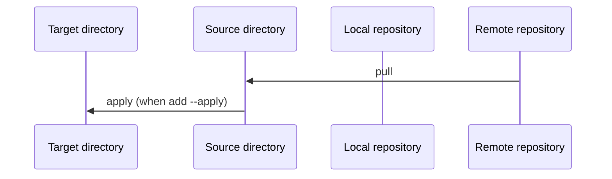
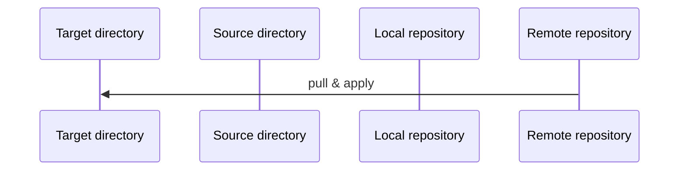
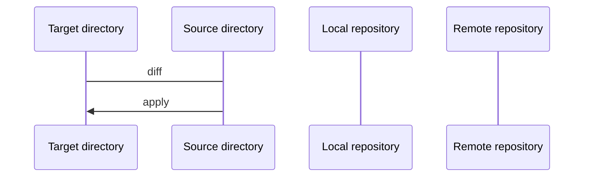
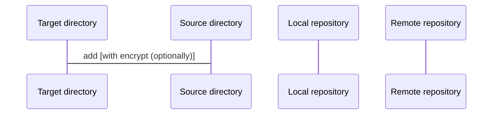
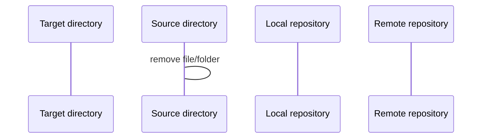

# kc's dotfiles

This is my personal dotfiles (configuration and settings for each program).

- [Configuration](#configuration)
- [Prerequisite](#prerequisite)
- [Get start](#get-start)
- [Useful commands](#useful-commands)
  - [To initiate dotfiles on local machine](#to-initiate-dotfiles-on-local-machine)
  - [To update local machine from remote repository](#to-update-local-machine-from-remote-repository)
  - [To apply state to your local machine](#to-apply-state-to-your-local-machine)
  - [To add new file from local machine](#to-add-new-file-from-local-machine)
  - [To remove file from current source](#to-remove-file-from-current-source)
- [Docker](#docker)
  - [Build docker image](#build-docker-image)
  - [Run docker image](#run-docker-image)
  - [To verify docker image](#to-verify-docker-image)

## Configuration

Below are a list of configuration I have on each categories.

- Zsh configuration

## Prerequisite

1. Install [zsh][zsh-url] (if not exist)
2. Install [python3][python-url] (if not exist)
3. Install [chezmoi][chezmoi-url]
4. Install [Gnupg][gnupg-url]
5. Install 1Password [app][1password-app-url] and [cli][1password-cli-url]

[zsh-url]: https://www.zsh.org
[python-url]: https://www.python.org/downloads
[chezmoi-url]: https://www.chezmoi.io/install
[gnupg-url]: https://www.gnupg.org/download/index.html
[1password-app-url]: https://1password.com/downloads
[1password-cli-url]: https://developer.1password.com/docs/cli/get-started

## Get start

Run `chezmoi init kc-workspace --apply` to initialize and apply config to your machine.

## Useful commands

> https://www.chezmoi.io/user-guide/daily-operations/
> https://www.chezmoi.io/user-guide/command-overview/

Below are a list of useful commands.

### To initiate dotfiles on local machine

Similar to **update** but initiatize new local directories.



```bash
## chezmoi init kc-workspace --apply
chezmoi init "<repo>" [--apply]
```

### To update local machine from remote repository

Similar to **init** but to update existed local directories.



```bash
chezmoi update
```

### To apply state to your local machine



```bash
## View the different between work state and local machine
chezmoi diff
chezmoi apply
```

### To add new file from local machine



```bash
chezmoi add "<filepath>"
chezmoi add --encrypt "<filepath>"
```

### To remove file from current source

This will only remove file from source directory, not target directory



```bash
chezmoi forget "<filepath>"
```

## Docker

### Build docker image

```bash
docker buildx build --tag kamontat/dotfiles:latest .
```

### Run docker image

You can run docker image on 2 modes: `full` or `minimal`.
When mode is empty string, it will start shell without any set up.
You can manually set up using `setup-*.sh` command

```bash
docker run -it --rm kamontat/dotfiles:latest "<MODE>"
```

Alternatively, you can start without mode and manually set up chezmoi using `setup-*.sh` command.

```bash
docker run -it --rm kamontat/dotfiles:latest
setup-full.sh
```

### To verify docker image

All docker image have attestations. You can verify the integrity and provenance
of an artifact using its associated cryptographically signed attestations.

The output of the verify command should contains as following information:

- Verify status: `✓ Verification succeeded!`
- **Repository** where image was created
- **Workflow** and **Git Reference** where image was created

To verify Docker Hub image:

```bash
# gh attestation verify oci://kamontat/dotfiles:latest --owner kc-workspace
$ gh attestation verify "oci://kamontat/dotfiles:<tag-name>" --owner kc-workspace

...
✓ Verification succeeded!
...
```

To verify GitHub Container Registry image:

```bash
## Add read:packages scope to read image from ghcr.
## You may need to login first: https://cli.github.com/manual/gh_auth_login
$ gh auth refresh --scopes "read:packages"

# gh auth token | docker login "ghcr.io" --username "kamontat" --password-stdin
$ gh auth token | docker login "ghcr.io" --username "<username>" --password-stdin

# gh attestation verify "oci://ghcr.io/kc-workspace/dotfiles:latest" --owner kc-workspace
$ gh attestation verify "oci://ghcr.io/kc-workspace/dotfiles:<tag-name>" --owner kc-workspace

...
✓ Verification succeeded!
...
```
