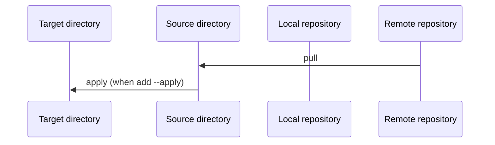
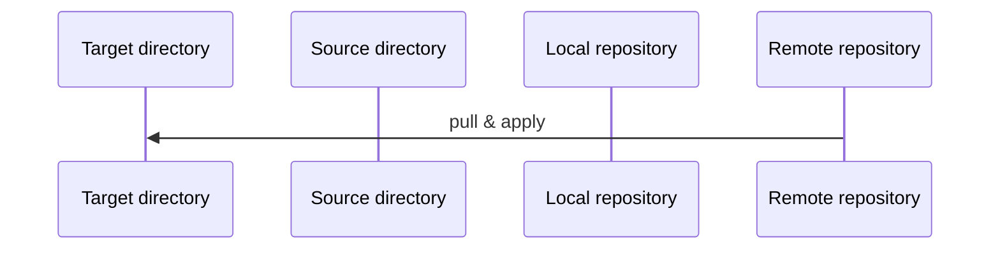
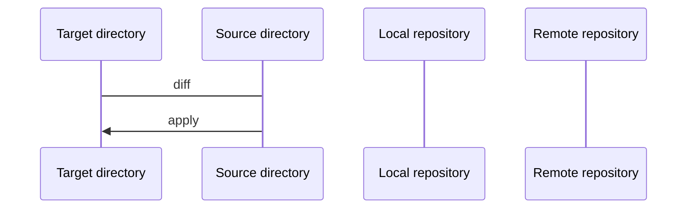
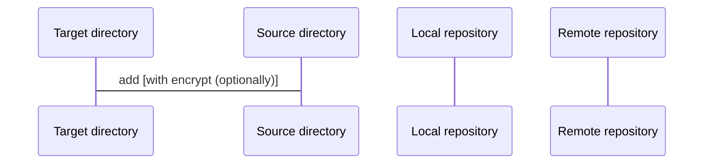

# kc's dotfiles

This is my personal dotfiles (configuration and settings for each program).

- [Configuration](#configuration)
- [Prerequisite](#prerequisite)
- [Get start](#get-start)
- [Useful commands](#useful-commands)
  - [To initiate dotfiles on local machine](#to-initiate-dotfiles-on-local-machine)
  - [To update local machine from remote repository](#to-update-local-machine-from-remote-repository)
  - [To apply state to your local machine](#to-apply-state-to-your-local-machine)
  - [To add new file from local machine](#to-add-new-file-from-local-machine)

## Configuration

Below are a list of configuration I have on each categories.

- Zsh configuration

## Prerequisite

1. You need to install chezmoi first: https://www.chezmoi.io/install/

## Get start

Run `chezmoi init kamontat --apply` to initialize and apply config to your machine.

## Useful commands

> https://www.chezmoi.io/user-guide/daily-operations/
> https://www.chezmoi.io/user-guide/command-overview/

Below are a list of useful commands.

### To initiate dotfiles on local machine

Similar to **update** but initiatize new local directories.



```bash
## chezmoi init kamontat --apply
chezmoi init "<repo>" [--apply]
```

### To update local machine from remote repository

Similar to **init** but to update existed local directories.



```bash
chezmoi update
```

### To apply state to your local machine



```bash
## View the different between work state and local machine
chezmoi diff
chezmoi apply
```

### To add new file from local machine



```bash
chezmoi add "<filepath>"
chezmoi add --encrypt "<filepath>"
```
